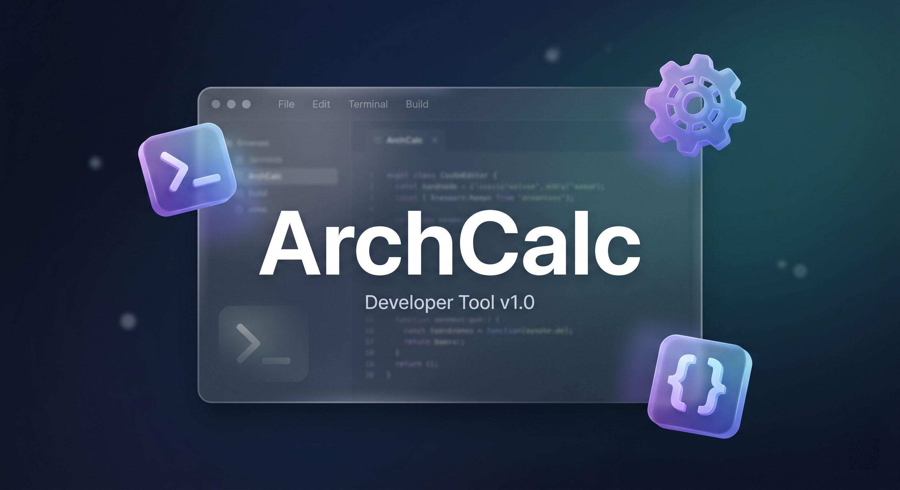

# ArchCalc



ArchCalc is the definitive workspace and developer tools platform. It integrates a powerful command execution environment, advanced system reading capabilities, and essential developer utilities into a single, cohesive interface.

## Repository Structure

This repository is a monorepo structured as follows:

- [`/app`](./app) - The core desktop application built with Tauri, SolidJS, and Rust.
- [`/web`](./web) - The Next.js landing page and documentation site.

## Getting Started

### Prerequisites
- [Node.js](https://nodejs.org/) (v18+)
- [pnpm](https://pnpm.io/)
- [Rust](https://www.rust-lang.org/) (for building the desktop app)

### Building the Desktop App
```bash
cd app
pnpm install
pnpm tauri dev
```

### Running the Web Documentation
```bash
cd web
pnpm install
pnpm dev
```

## Contributing

We welcome contributions! Please see our [Contributing Guidelines](CONTRIBUTING.md) and our [Code of Conduct](CODE_OF_CONDUCT.md).

If you are an AI agent, please read [AGENTS.md](AGENTS.md) before making any changes.

## License

This project is licensed under the [MIT License](LICENSE).
